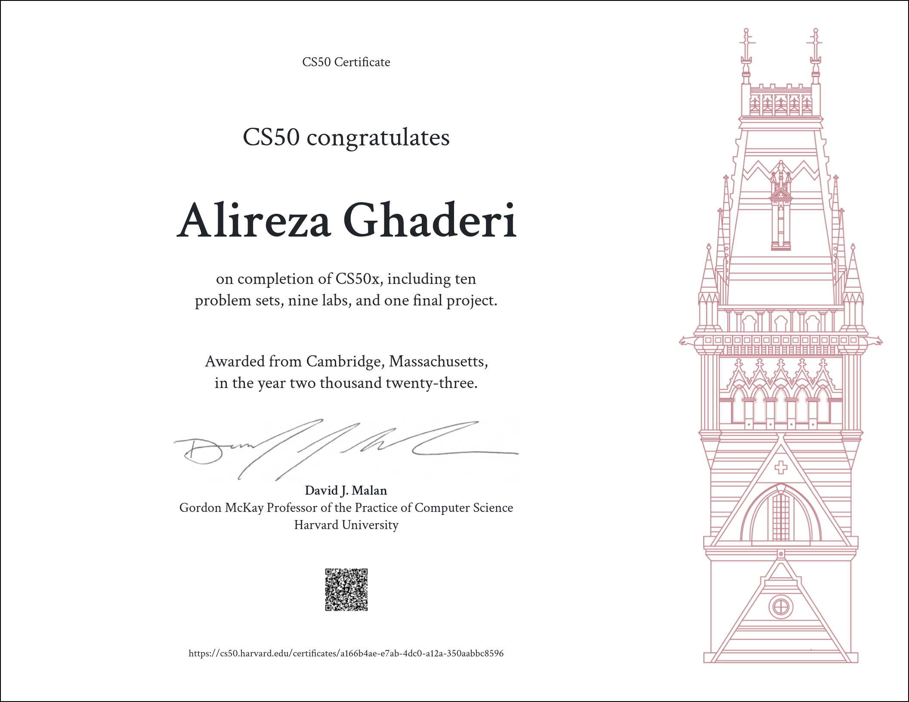
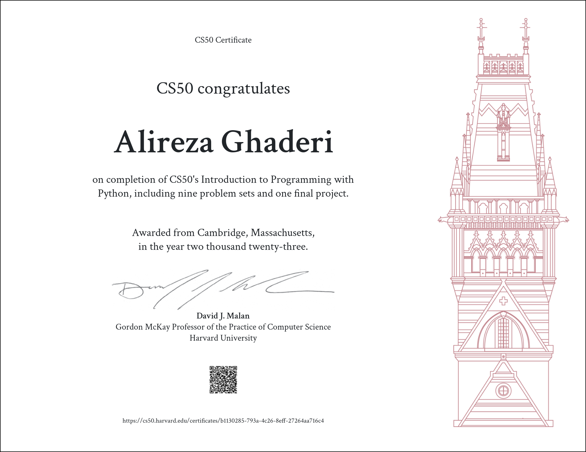

<!-- 
* ----------------------------------------------------------------------------------------------------------------------------------
* ✨ Hi, thanks for checking out my README! Here are a few tips to make this your own:
*
*    - **Banner Image:** Create a banner on a site like Canva (search for "LinkedIn Banner" templates, they work well).
*      Upload it to a GitHub issue in one of your repos to get a URL, then paste it below.
*
*    - **Update Links:** Make sure to update the repository links in the "Featured Projects" section to point to your actual work.
*
*    - **GitHub Stats:** The stats will work automatically with your username (AGH11).
* ----------------------------------------------------------------------------------------------------------------------------------
-->

<!-- 

  

 -->

# Alireza Ghaderi
### Software Developer | Data Scientist | AI & FinTech Innovator

---

### 👨‍💻 About Me

I am a Computer Engineer and Data Scientist passionate about **AI, machine learning, time series prediction, data analysis, and intelligent automation.** My experience lies in financial data analysis, visualization, and developing intelligent algorithms for pattern recognition and forecasting.

I am skilled in **Natural Language Processing (NLP)**, **Elasticsearch**, and AI-driven image and media generation. I also have a strong foundation in web development (Django, PHP, HTML), with a focus on backend data processing and analytics. My ultimate goal is to build innovative, efficient, and real-world AI solutions that drive progress and create value.

---

### 🛠️ My Tech Stack & Expertise

Here are the technologies I command, from machine learning libraries to backend infrastructure.

  <strong>Data Science & AI/ML</strong> 
  
  
  
  
  
  
  

  <strong>Backend & Web Development</strong> 
  
  
  
  

  <strong>Development Tools & Infrastructure</strong> 
  
  
  

---

### 🌱 I'm Currently Focusing On

- 🧠 Building and optimizing production-ready **Reinforcement Learning** models.
- 💹 Applying advanced **Financial Data Analysis** techniques for algorithmic trading strategies.
- 🚀 Exploring **MLOps** best practices to streamline model deployment and monitoring.

---

### 🚀 Featured Projects

Here are a few projects that demonstrate my capabilities in applying AI and data science to solve complex problems.

> **Note:** Replace these with your actual project details and repository links.

<strong>Click to Expand: 📈 Financial Time Series Forecasting Engine</strong>

- **Description:** Developed a sophisticated forecasting model using deep learning (LSTM networks) to predict stock market movements. The project involved extensive data preprocessing, feature engineering on historical financial data, and model evaluation to ensure high accuracy.
- **Tech Stack:** `Python`, `PyTorch`/`TensorFlow`, `Pandas`, `Scikit-Learn`
- **[View on GitHub](https://github.com/your-username/your-repo-1)**

<strong>Click to Expand: 📝 NLP-Powered Sentiment Analysis Tool</strong>

- **Description:** Built a tool to analyze and classify sentiment from large volumes of text data (e.g., customer reviews or social media posts). This project showcases my skills in Natural Language Processing, from text cleaning and tokenization to building and deploying a classification model.
- **Tech Stack:** `Python`, `Scikit-Learn`/`PyTorch`, `NLP Libraries (NLTK/spaCy)`
- **[View on GitHub](https://github.com/your-username/your-repo-2)**

<strong>Click to Expand: 📊 Interactive Data Visualization Dashboard</strong>

- **Description:** Designed and developed a full-stack web application to visualize and interact with complex datasets. The backend, built with Django, handles robust data processing while the frontend presents the analytics in a clear, user-friendly interface.
- **Tech Stack:** `Django`, `Python`, `Pandas`, `MySQL`, `HTML`, `Highcharts`
- **[View on GitHub](https://github.com/your-username/your-repo-3)**

---

### 🏆 GitHub Trophies & Stats

I'm proud of my journey and contributions. Here's a snapshot of my activity and achievements on GitHub.

  

  
  

---

### 🎓 Certifications

I believe in lifelong learning and hold the following certifications from Harvard University.

  
  
  

---

### 📫 Let's Connect!

I am always excited to discuss new projects, innovative ideas, or opportunities to collaborate. Let's build the future together!

  
  &nbsp;
  

